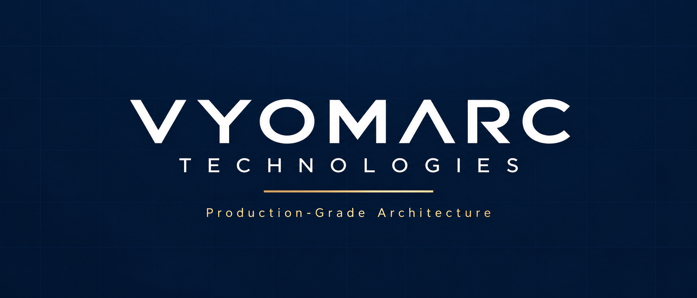
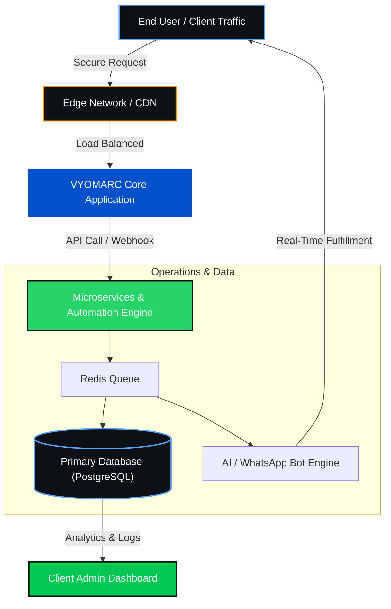

  

<h1 align="center">The VYOMARC Engineering Playbook</h1>
<h3 align="center">Architecting Scalable Digital Ecosystems, AI Automation, and High-Performance Web Infrastructure</h3>

  
  
  

---

## 📌 Executive Summary

This repository serves as the public technical standard and knowledge base of **VYOMARC Technologies**. We document production-tested software design patterns, AI automation pipelines, digital brand positioning (SEO), and custom web architectures. 

Our core philosophy is simple: **We build technology that solves actual business bottlenecks.** Whether it is engineering a zero-latency web platform to capture regional market share, or deploying self-hosted micro-SaaS dashboards to eliminate manual operations, this playbook covers the exact architectures that drive revenue and scale.

---

## 🗂️ Knowledge Base & Architecture Domains

To maintain scalability, all our technical playbooks, case studies, and engineering notes are categorized into specific domain directories. Navigate to any section above to explore our latest architectural breakdowns:

*   📂 **`/web-architecture`** — Zero-latency core, headless CMS setups, Core Web Vitals optimization, and high-concurrency routing.
*   📂 **`/ai-automation`** — Meta Cloud API workflows, automated WhatsApp commerce, and NLP-driven customer intent routing.
*   📂 **`/edtech-systems`** — Anti-cheat mechanisms for CBT (Computer-Based Testing), secure fee-management pipelines, and RBAC deployments.
*   📂 **`/micro-saas`** — Multi-tenant database schemas, self-hosted admin dashboards, and internal business tools.
*   📂 **`/growth-and-seo`** — Entity-based local indexing, OCR SEO optimization, and strategies for Google AI Overviews dominance.

*(Just browse the repository folders to find our latest published markdown guides on these topics.)*

---

## 🛠️ Technology Stack & Toolchain

*Our production systems are built on resilient, high-performance tech stacks designed for long-term scalability and security.*

  

*   **Frontend:** TypeScript, Next.js, React, Tailwind CSS *(Mobile-First Optimization)*
*   **Backend & Logic:** Node.js, Express microservices, Python automation scripts
*   **Database & Caching:** PostgreSQL, Supabase, Redis for high-speed queue handling
*   **Infrastructure:** AWS, Docker containerization, Cloudflare edge security

---

## 🏗️ Core System Architecture (Standard Deployment)

---

## 🎯 Target Implementations

> **Vertical-Specific Engineering:** We do not believe in one-size-fits-all solutions. Our architectural implementations are precision-tailored to specific industry verticals:

  
<b>🏢 Scalable Web Development for Enterprises</b>

   
  Custom engineering designed to replace obsolete brochure websites. Focused heavily on conversion-rate optimization, lightning-fast mobile responsiveness, and entity-based SEO visibility for businesses outgrowing generic templates.

  
<b>🤖 AI & WhatsApp Automation Systems</b>

   
  Direct API integrations enabling retail operations, restaurants, and service firms to close sales, schedule appointments, and collect payments autonomously—eliminating reliance on third-party aggregator commissions.

  
<b>🎓 Institutional Automation & EdTech Systems</b>

   
  Comprehensive software ecosystems for coaching centers, colleges, and educational institutes. This includes fully automated fee collection desks, ledger tracking, and highly secure Computer-Based Testing (CBT) environments.

---

## 👨‍💼 Architecture & Implementation Inquiries

> **Maintainer:** This knowledge base is curated and actively maintained by **Saurabh**, Founder and Lead Systems Architect at **VYOMARC Technologies**.
> 
> **Status:** If your business has outgrown generic web templates and requires battle-tested, revenue-generating software infrastructure, our engineering desk is open for high-ticket integrations.

  
  
  

---

  Documenting high-performance engineering standards. Setting the benchmark for software and website development excellence.

