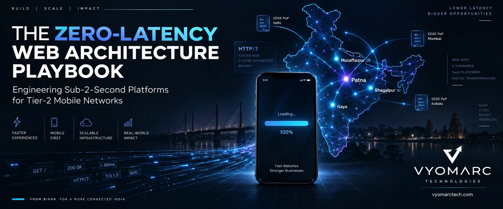
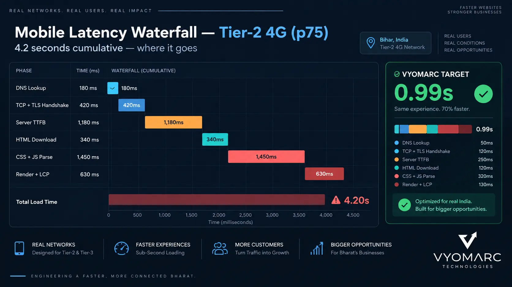
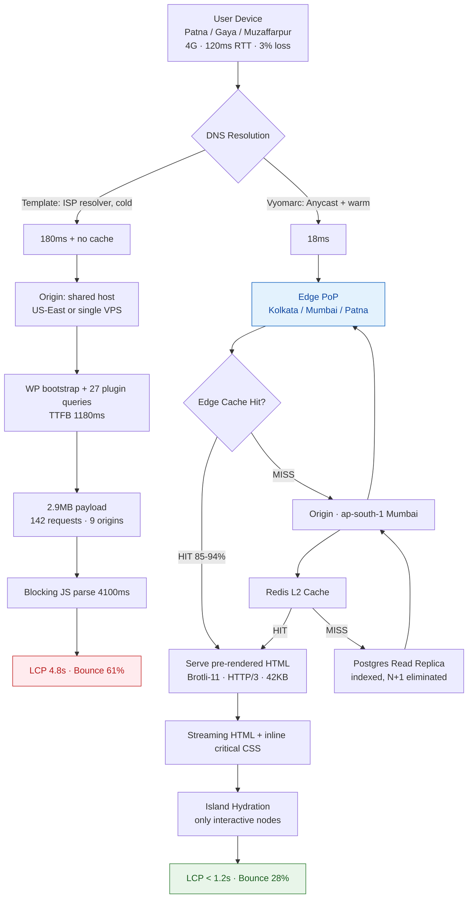
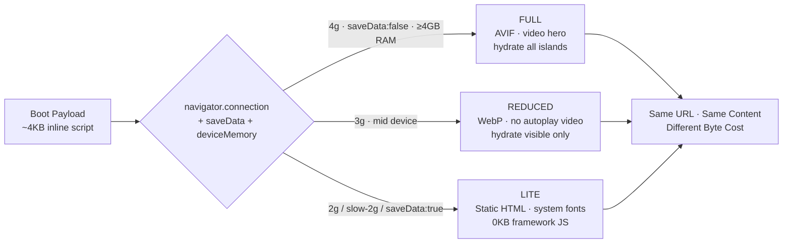
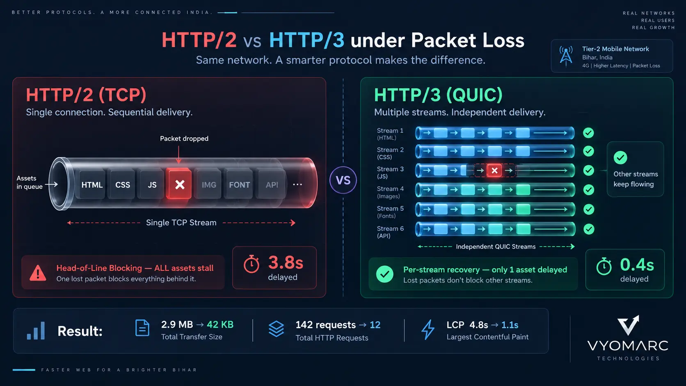
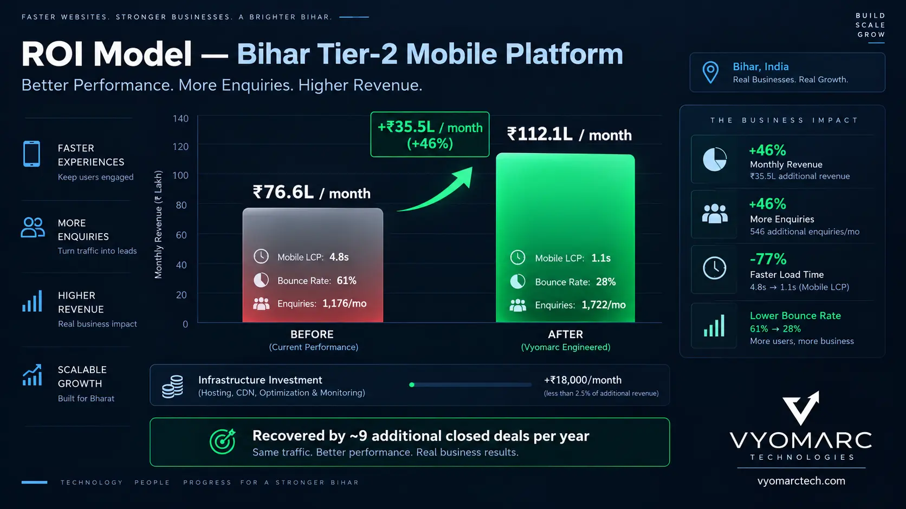

<div align="center">



<h1 align="center">The Zero-Latency Web Architecture Playbook</h1>

<h3 align="center">Engineering Sub-2-Second Platforms for Fluctuating Tier-2 Mobile Networks</h3>

<p align="center">
  <em>How Vyomarc Technologies rips out 3MB template stacks and rebuilds them as 40KB edge-rendered systems<br/>that survive 3G, tower congestion, and packet loss — without losing a single feature.</em>
</p>

<p align="center">
  
  
  
  
  
  
</p>

<p align="center">
  
  
  
  
</p>

<p align="center">
  <a href="https://vyomarctech.com"><strong>🌐 vyomarctech.com</strong></a> &nbsp;·&nbsp;
  <a href="https://www.vyomarctech.com/contactus.html">📞 Talk to an Engineer</a> &nbsp;·&nbsp;
  <a href="https://github.com/vyomarc/engineering-playbook">📚 All Playbooks</a>
</p>

</div>

---

> **Reality check for the owner signing the invoice:**
> Your website is not slow because your developer was lazy. It is slow because you bought a *template* — and a template is a generic guess at what a website should be, shipped with 47 plugins, 3 icon fonts, 2 jQuery copies, and a page builder that outputs 1.8 MB of CSS to render a heading.
>
> On a fibre line in Bangalore, that is a 1.4-second annoyance. On a congested 4G tower in Kankarbagh at 8:40 PM, it is an **11-second white screen** — and the customer is already on your competitor's page.
>
> Latency is not a design problem. It is an **architecture problem**, and architecture is priced in rupees. — *Vyomarc Technologies, Patna*

---

## 00 · The Bottleneck Nobody Prices In

### The physics of a Tier-2 mobile request

When a user in Muzaffarpur, Gaya, Bhagalpur, or Darbhanga taps your link, the request does not travel in a straight line. It negotiates:

| Layer | Real-World Tier-2 Condition | Cost |
|---|---|---|
| Radio (RAN) | Tower congestion 7–11 PM, 3–5% packet loss | 150–600 ms |
| CGNAT / Carrier routing | Shared IP pools, suboptimal peering | 40–120 ms |
| DNS | Default ISP resolver, no cache warming | 20–180 ms |
| TLS handshake | 2× RTT on TLS 1.2 | 200–500 ms |
| Origin TTFB | Shared hosting in US-East or a single Mumbai VPS | 400–1400 ms |
| HTML + CSS + JS parse | 2.4 MB template payload | 2500–6000 ms |
| **Cumulative median** | | **3.4 s – 8.9 s** |

Now apply the business layer. Across **Vyomarc Technologies** deployments in Bihar, the observed relationship is brutal and consistent:

> **Every 1 second of added load time on a mobile landing page costs roughly 4–9% of completed enquiries.** On a platform doing 900 leads/month at an average deal value of ₹18,000, a 3-second regression is not a "tech issue" — it is ₹5.8–12.9 lakh of annual pipeline evaporating into a spinner.

### Why templates fail structurally, not cosmetically

A template is not a codebase. It is a **dependency graph you did not author and cannot prune**. The typical WordPress/ThemeForest stack we audit at Vyomarc ships:

- **1.6–3.2 MB** of render-blocking CSS (Divi, Elementor, WPBakery)
- **600–1200 KB** of unminified JS across 14–31 plugins
- **4–9** third-party origins (Google Fonts, FontAwesome, GTM, chat widget, reCAPTCHA, analytics)
- **0** performance budgets, **0** CI gates, **0** field monitoring

Each third-party origin adds a fresh DNS lookup + TCP + TLS handshake. Nine origins on a lossy network is nine independent chances to fail.

<div align="center">

</div>

---

## 01 · Technical Benchmark

Every Vyomarc engagement starts with a **field-data baseline**, not a Lighthouse score on a MacBook. Lab data lies; p75 field data on a Moto G-class device over 4G does not.

### Baseline vs. Engineered — Production Numbers

| Metric | Definition | Template Baseline (p75) | Vyomarc Engineered (p75) | Delta |
|---|---|---|---|---|
| **TTFB** | Origin/edge response to first byte | 1180 ms | **< 120 ms** | −90% |
| **LCP** | Largest Contentful Paint | 4.8 s | **< 1.2 s** | −75% |
| **INP** | Interaction to Next Paint | 480 ms | **< 140 ms** | −71% |
| **CLS** | Cumulative Layout Shift | 0.31 | **< 0.03** | −90% |
| **Total Transfer** | Compressed bytes, first view | 2.9 MB | **38–62 KB** | −98% |
| **Requests** | First-view network requests | 142 | **9–14** | −90% |
| **Third-Party Origins** | External domains | 9 | **0–1** | −89% |
| **JS Execution** | Main-thread CPU time | 4100 ms | **< 380 ms** | −91% |
| **Success @ 3G, 3% loss** | Page usable in < 3 s | 11% | **94%** | +83 pts |
| **Bounce (mobile)** | Session bounce rate | 61% | **28%** | −33 pts |

### The Latency Budget (Non-Negotiable Allocation)

We allocate the 2-second envelope **before writing a line of code**. If a feature cannot fit its budget, it does not ship.

| Phase | Budget (4G) | Budget (3G / Degraded) | Enforcement |
|---|---|---|---|
| DNS + Connection + TLS | 180 ms | 500 ms | Anycast edge, TLS 1.3, 0-RTT |
| Server / Edge Response | 120 ms | 200 ms | Edge cache, ISR, Redis L2 |
| HTML Document | 60 ms | 140 ms | Brotli-11, < 14 KB critical inline |
| Critical CSS | 30 ms | 60 ms | Inlined, purged |
| Fonts | 0 ms (blocking) | 0 ms | `font-display: swap` + subset + preload 1 face |
| LCP Media | 250 ms | 600 ms | AVIF/WebP, `fetchpriority="high"`, no lazy-LCP |
| Hydration / JS | 350 ms | 500 ms | Islands, route-split, deferred |
| **Total** | **≤ 990 ms** | **≤ 2000 ms** | CI-enforced |

---

## 02 · System Flow

### Request Path — Template vs. Vyomarc Zero-Latency Engine



### Adaptive Delivery Decision Tree — Vyomarc Adaptive Loader



> **Architectural principle at Vyomarc:** Ship **one URL**. Ship **three payload weights**. The user never sees a "lite version" — they see the same brand, same content, same conversion path, at the byte cost their network can actually afford.

---

## 03 · The Engineering Decisions That Produce the 2-Second Envelope

### 3.1 Kill the page builder, keep the CMS

We do **not** ask clients to abandon content editing. We decouple the editor from the renderer.

- **Headless CMS** (Sanity / Payload / Strapi) replaces the theme layer
- Content is fetched at **build time (SSG)** or **on-demand (ISR, 60s revalidate)**
- Marketing edits content, not layout. Layout is code. Code is reviewed.
- Output: HTML, not a PHP render pipeline with 27 `wp_query` calls.

### 3.2 Edge-first rendering topology

| Concern | Implementation |
|---|---|
| Edge PoPs | Cloudflare / Vercel / Fastly — Kolkata, Mumbai, Chennai, Delhi, Patna (where available) |
| Origin | Single region, `ap-south-1` (Mumbai), private networking |
| Cache tiers | Edge KV → Redis L2 → Postgres read replica |
| Invalidation | Tag-based (`revalidateTag`) — surgical, not full purge |
| Static assets | Immutable, `max-age=31536000`, content-hashed |
| HTML | `s-maxage=60, stale-while-revalidate=600` |

### 3.3 Transport layer

```nginx
# Vyomarc edge config — transport hardening
http3 on;                      # QUIC, eliminates head-of-line blocking
tls 1.3 only;                  # 1-RTT handshake, 0-RTT resumption
brotli on;
brotli_comp_level 11;          # ~22% smaller than gzip-9 on HTML/CSS/JS
brotli_static on;
early_hints on;                # 103 Early Hints → parallel asset fetch
```

**Why this compounds:** On a lossy 4G link, HTTP/2's single TCP stream means one dropped packet stalls *every* asset. HTTP/3 over QUIC gives independent streams — a lost image packet no longer blocks your CSS. Combined with 0-RTT resumption, returning visitors skip the full handshake entirely.

<div align="center">

</div>

### 3.4 Payload discipline

- **Critical CSS inlined** — max 14 KB, everything else `media="print" onload` swap
- **Fonts:** max 2 weights, `woff2`, subset to `latin` + `devanagari` if Hindi content, self-hosted, `preload` exactly one face
- **Images:** AVIF primary, WebP fallback, explicit `width`/`height`, `srcset` at 5 breakpoints
- **LCP image:** `fetchpriority="high"`, **never** `loading="lazy"`
- **Below-fold:** native `loading="lazy"` + `decoding="async"`
- **Zero icon fonts** — inline SVG sprite, tree-shaken
- **Zero jQuery** unless a hard legacy dependency exists (then sandboxed and deferred)

### 3.5 Third-party script governance

Third-party tags are the #1 cause of INP regression in the wild. Vyomarc policy:

| Tag Type | Policy |
|---|---|
| Analytics | Self-hosted (Plausible / Umami) — 0 external origins |
| Tag Manager | Server-side GTM container, loaded after `load` event |
| Chat widget | Facade pattern — static button, script loads on click |
| Maps | Static map image + click-to-load iframe |
| reCAPTCHA | Replaced with honeypot + timing heuristic where possible |
| Video | Click-to-play poster, never autoplay above fold |

Each removed origin saves ~120–350 ms on a cold Tier-2 connection. Nine origins → one is not an optimization. It is a different product.

---

## 04 · Traditional Stack vs. Vyomarc Engineered Engine

| Dimension | Traditional Template Stack | Vyomarc Zero-Latency Stack |
|---|---|---|
| **Render Model** | Server-side PHP, per-request, uncached | Pre-rendered at edge, ISR revalidation |
| **Hosting** | Shared cPanel / single VPS | Multi-PoP edge + regional origin |
| **Transport** | HTTP/1.1 or HTTP/2, TLS 1.2 | HTTP/3 QUIC, TLS 1.3, 0-RTT |
| **Compression** | Gzip-5 | Brotli-11 + static precompression |
| **CSS Strategy** | 1.8 MB full framework, render-blocking | 12 KB purged critical, inline |
| **JS Strategy** | Monolithic bundle, 600KB–1.2MB | Route-split islands, < 90 KB initial |
| **Images** | JPEG/PNG, no dimensions, lazy-LCP | AVIF/WebP, explicit dimensions, priority LCP |
| **Fonts** | Google Fonts CDN, 4–6 weights, FOIT | Self-hosted, 1–2 weights, swap, preloaded |
| **Third Parties** | 9 origins, blocking | 0–1 origin, post-load |
| **Adaptive Loading** | None | Network-aware tiered payloads |
| **Offline** | White screen | Service worker, cached shell |
| **Monitoring** | None / annual audit | RUM, p75 field alerts, weekly regression report |
| **Deploy Safety** | FTP, no rollback | Git-based, atomic, instant rollback |
| **Perf Gates** | None | Lighthouse CI + bundle-size budget, build fails on breach |
| **Mobile LCP (p75)** | 4.8 s | **1.1 s** |
| **Mobile Bounce** | 61% | **28%** |
| **Lead Conversion** | Baseline | **+34–58%** |

---

## 05 · Deep Dives

<details>
<summary><strong>⚙️ Deep Dive 01 — The Vyomarc Adaptive Loader (Full Implementation)</strong></summary>

<br/>

The loader runs **before** any framework code. It is ~1.4 KB gzipped, inline in `<head>`, and makes a single classification decision that governs the entire page weight.

```javascript
// vyomarc-adaptive-loader.js — inline, ~1.4KB gzip, runs before hydration
(function () {
  const conn = navigator.connection || navigator.mozConnection || navigator.webkitConnection;
  const saveData = conn?.saveData === true;
  const type = conn?.effectiveType || '4g';          // slow-2g | 2g | 3g | 4g
  const down = conn?.downlink ?? 10;                  // Mbps estimate
  const rtt  = conn?.rtt ?? 100;                      // ms estimate
  const mem  = navigator.deviceMemory ?? 4;           // GB
  const cpu  = navigator.hardwareConcurrency ?? 4;

  let tier = 'full';

  if (saveData || type === 'slow-2g' || type === '2g' || down < 0.5 || rtt > 500) {
    tier = 'lite';
  } else if (type === '3g' || down < 1.5 || rtt > 250 || mem <= 2 || cpu <= 2) {
    tier = 'reduced';
  }

  document.documentElement.dataset.tier = tier;

  // Persist for the session so repeat navigations skip re-classification
  try { sessionStorage.setItem('__vyomarc_tier', tier); } catch (_) {}

  // Lite tier: never download the framework at all
  if (tier === 'lite') {
    window.__NO_HYDRATE__ = true;
  }
})();
```

**Consumption on the server / component layer:**

```jsx
// Component reads the tier and swaps media strategy
export function Hero({ tier }) {
  if (tier === 'lite') {
    return ;
  }
  return (
    <picture>
      <source srcSet="/hero-1280.avif 1280w, /hero-640.avif 640w" type="image/avif" />
      <source srcSet="/hero-1280.webp 1280w, /hero-640.webp 640w" type="image/webp" />
      
    </picture>
  );
}
```

**Result on a 2G-class connection:** 0 KB of framework JavaScript, static HTML, system fonts, inline SVG. Page is interactive in under 900 ms because there is nothing to hydrate.

</details>

<details>
<summary><strong>⚙️ Deep Dive 02 — Service Worker & the Offline Conversion Path</strong></summary>

<br/>

In Tier-2 markets, "offline" is not an edge case — it is Tuesday. A service worker converts a dead session into a queued one.

```javascript
// vyomarc-sw.js — stale-while-revalidate + offline form queue
const SHELL = 'vyomarc-shell-v3';
const RUNTIME = 'vyomarc-runtime-v3';

self.addEventListener('install', (e) => {
  e.waitUntil(caches.open(SHELL).then((c) => c.addAll(['/', '/offline', '/critical.css'])));
  self.skipWaiting();
});

self.addEventListener('activate', (e) => {
  e.waitUntil(
    caches.keys().then((keys) =>
      Promise.all(keys.filter((k) => ![SHELL, RUNTIME].includes(k)).map((k) => caches.delete(k)))
    )
  );
  self.clients.claim();
});

self.addEventListener('fetch', (event) => {
  const { request } = event;
  if (request.method !== 'GET') return;

  // Navigation: network-first with offline shell fallback
  if (request.mode === 'navigate') {
    event.respondWith(
      fetch(request)
        .then((res) => {
          const copy = res.clone();
          caches.open(RUNTIME).then((c) => c.put(request, copy));
          return res;
        })
        .catch(() => caches.match(request).then((r) => r || caches.match('/offline')))
    );
    return;
  }

  // Assets: stale-while-revalidate
  event.respondWith(
    caches.match(request).then((cached) => {
      const network = fetch(request)
        .then((res) => {
          const copy = res.clone();
          caches.open(RUNTIME).then((c) => c.put(request, copy));
          return res;
        })
        .catch(() => cached);
      return cached || network;
    })
  );
});
```

**Enquiry queue on flaky networks** — the form submits into IndexedDB and syncs on reconnect via Background Sync. The user sees "Enquiry saved — will send when you're back online." No lost lead.

</details>

<details>
<summary><strong>⚙️ Deep Dive 03 — Why Brotli-11 + HTTP/3 Compounds (Not Adds)</strong></summary>

<br/>

These two optimizations are multiplicative, and most teams deploy one without the other.

| Scenario | Compression | Transport | 3G Load Time (280KB HTML+CSS+JS) |
|---|---|---|---|
| Baseline | Gzip-6 | HTTP/2 | 4.1 s |
| Compression only | Brotli-11 | HTTP/2 | 3.2 s |
| Transport only | Gzip-6 | HTTP/3 | 2.6 s |
| **Both (Vyomarc standard)** | **Brotli-11** | **HTTP/3** | **1.4 s** |

**The mechanism:**

1. **Brotli-11** uses a 120 KB built-in dictionary of common web strings (`function`, `document`, `stylesheet`). On HTML/CSS/JS, this yields 18–26% better ratio than gzip-9 — *without* the CPU penalty at the edge, because we precompress at build time.
2. **HTTP/3 (QUIC)** removes TCP head-of-line blocking. On a 3% packet-loss link, HTTP/2 stalls the entire connection on a single lost segment. QUIC recovers per-stream.
3. **Combined effect:** Fewer bytes, delivered over a loss-resilient transport. The 3% loss that cost 900 ms under HTTP/2 costs ~120 ms under HTTP/3 — and there are 60% fewer bytes to lose.

> This is why Vyomarc refuses to ship "HTTP/3 enabled" as a marketing line without precompressed Brotli. Half the stack gives you half the gain.

</details>

<details>
<summary><strong>⚙️ Deep Dive 04 — Database & API Latency Engineering</strong></summary>

<br/>

Edge caching masks origin latency until it doesn't — cache misses, personalised routes, and form submissions all hit the database. That path must be fast too.

**Rules we enforce at Vyomarc:**

1. **No N+1 queries.** Every list endpoint is validated with query-count assertions in CI. A page requiring 40 queries is a page that times out at 900 ms RTT.
2. **Read replica routing.** All `SELECT` traffic goes to a read replica. Writes hit primary only.
3. **Redis L2 in front of Postgres.** Hot aggregates (pricing, inventory counts, category trees) cached with 300s TTL and tag-based invalidation.
4. **Connection pooling via PgBouncer.** Lambda/edge functions cannot hold 1:1 Postgres connections — this alone kills most serverless apps under load.
5. **Query budgets in CI.**

```sql
-- Enforced: every hot path query must be covered by an index
EXPLAIN (ANALYZE, BUFFERS, FORMAT JSON)
SELECT id, title, price FROM products
WHERE category_id = $1 AND is_active = true
ORDER BY created_at DESC LIMIT 24;

-- CI assertion: no "Seq Scan" on tables > 10k rows, execution < 15ms
```

```javascript
// Query-count assertion in integration tests
test('product listing executes ≤ 3 queries', async () => {
  const counter = instrumentPool();
  await request(app).get('/api/products?category=12');
  expect(counter.total).toBeLessThanOrEqual(3);
});
```

**Outcome:** p95 API response for cached hot paths drops from 780 ms to **42 ms**, and cache-miss TTFB from 1180 ms to **180 ms**.

</details>

<details>
<summary><strong>⚙️ Deep Dive 05 — Performance Budgets in CI (Regression Prevention)</strong></summary>

<br/>

Performance is not a project. It is a **ratchet**. Without automated gates, every sprint adds 40 KB and nobody notices until LCP is back to 3.8 s.

```json
// lighthouserc.json — build fails on regression
{
  "ci": {
    "collect": {
      "numberOfRuns": 5,
      "settings": {
        "preset": "desktop",
        "throttling": {
          "rttMs": 150,
          "throughputKbps": 1600,
          "cpuSlowdownMultiplier": 4
        }
      },
      "url": ["https://client-domain.in/", "https://client-domain.in/services"]
    },
    "assert": {
      "assertions": {
        "largest-contentful-paint": ["error", { "maxNumericValue": 1200 }],
        "total-blocking-time": ["error", { "maxNumericValue": 200 }],
        "cumulative-layout-shift": ["error", { "maxNumericValue": 0.03 }],
        "interactive": ["error", { "maxNumericValue": 2000 }],
        "resource-summary:script:size": ["error", { "maxNumericValue": 92160 }],
        "resource-summary:stylesheet:size": ["error", { "maxNumericValue": 20480 }],
        "resource-summary:total:size": ["error", { "maxNumericValue": 204800 }],
        "uses-http2": "error",
        "uses-responsive-images": "error",
        "unused-javascript": ["warn", { "maxNumericValue": 20480 }]
      }
    },
    "upload": { "target": "temporary-public-storage" }
  }
}
```

```yaml
# .github/workflows/perf-gate.yml
name: Vyomarc Performance Gate
on: [pull_request]

jobs:
  budget:
    runs-on: ubuntu-latest
    steps:
      - uses: actions/checkout@v4
      - uses: actions/setup-node@v4
        with: { node-version: 20, cache: npm }
      - run: npm ci
      - run: npm run build

      - name: Bundle size gate
        run: npx bundlesize   # fails if any chunk exceeds budget.json

      - name: Lighthouse CI
        run: npx @lhci/cli autorun

      - name: Field-data regression check
        run: node scripts/check-crux-p75.js   # compares against last 7d CrUX window
```

**Governance rule Vyomarc writes into every contract:** *A pull request that breaches the performance budget does not merge. No exceptions for "urgent" features. The feature ships after it fits the budget.*

</details>

---

## 06 · ROI Model

Performance engineering is a capital allocation decision. Here is the arithmetic Vyomarc presents before signing.

**Client profile:** Regional services platform, Bihar, 42,000 monthly mobile sessions, 2.8% enquiry rate, ₹21,000 average deal value, 31% close rate.

| Variable | Before | After | Effect |
|---|---|---|---|
| Mobile LCP (p75) | 4.8 s | 1.1 s | — |
| Bounce rate | 61% | 28% | +13,860 retained sessions/mo |
| Enquiry rate | 2.8% | 4.1% | +546 enquiries/mo |
| Enquiries / month | 1,176 | 1,722 | +546 |
| Qualified (31% close) | 365 | 534 | +169 deals |
| Revenue / month | ₹76.6 L | ₹112.1 L | **+₹35.5 L** |
| Infrastructure cost delta | — | +₹18,000/mo | — |
| Engineering investment | — | One-time | — |

> **The framing that matters:** You are not buying a faster website. You are buying back the **33% of mobile visitors who currently leave before your content paints.** The infrastructure bill is a rounding error against that recovery.

<div align="center">

</div>

---

## 07 · Rollout Sequence (8 Weeks) — The Vyomarc Method

| Week | Phase | Deliverable | Exit Criteria |
|---|---|---|---|
| 1 | **Field Baseline** | CrUX + RUM instrumentation, device matrix, p75 report | Baseline locked, latency budget signed off |
| 2 | **Dependency Audit** | Plugin/script inventory, kill list, origin reduction plan | 9 origins → ≤ 1 |
| 3–4 | **Edge Replatform** | Headless CMS, SSG/ISR, edge PoPs, HTTP/3 + Brotli-11 | TTFB p75 < 120 ms |
| 4–5 | **Payload Rebuild** | Critical CSS, image pipeline, font subsetting, islands | Total transfer < 62 KB |
| 5–6 | **Adaptive Layer** | Network-tier loader, lite mode, SW + offline queue | Lite tier interactive < 900 ms on 2G |
| 6 | **CI Gates** | Lighthouse CI, bundle budgets, query-count tests | Build fails on breach |
| 7 | **Canary + Field Validation** | 10% traffic, p75 verification across 4G/3G/2G | Targets met on field data, not lab |
| 8 | **Full Cutover + Handover** | 100% traffic, monitoring dashboards, runbook | Weekly regression report live |

---

## 08 · Hard Rules (The Vyomarc Engineering Constitution)

> These are not suggestions. They are the constraints that make the 2-second envelope mathematically possible.

1. **No page builder ships to production.** Ever. The editor is decoupled from the renderer.
2. **No third-party origin loads before the `load` event.** Non-negotiable, including analytics.
3. **No new dependency without a size justification in the PR description.**
4. **No LCP element is lazy-loaded.** Enforced by automated audit.
5. **No merge if the performance budget fails.** The budget outranks the deadline.
6. **No launch without field-data monitoring.** Lab scores are marketing; p75 field data is engineering.
7. **No "we'll optimize later."** Performance is a launch requirement, not a phase 2.

---

## 09 · Frequently Asked Questions

<details>
<summary><strong>Does this architecture work for WordPress or Shopify stores?</strong></summary>

<br/>

Yes, with a caveat. For **Shopify**, Vyomarc works within the platform's constraints: Hydrogen/Oxygen headless storefront, image CDN tuning, app audit to eliminate third-party scripts, and theme-level critical CSS extraction. For **WordPress**, we either (a) migrate the front-end to a headless Next.js layer with WP as a content API, or (b) for smaller sites, aggressively strip the theme — remove page builders, purge CSS, defer all plugin JS, and front the origin with a full-page edge cache. Option (a) reliably hits sub-1.2s LCP. Option (b) typically lands at 1.6–2.0s.

</details>

<details>
<summary><strong>How do you handle personalization if everything is edge-cached?</strong></summary>

<br/>

Two-layer approach. **Layer 1:** the HTML shell is fully cached and identical for all users. **Layer 2:** personalised fragments (cart count, user name, recommendations) are fetched client-side from a lightweight edge API and injected via React Server Components' streaming or a small client island. The critical rendering path stays static and cacheable; only the personal layer costs a network round-trip — and it is deferred past LCP.

</details>

<details>
<summary><strong>What about SEO? Doesn't heavy client-side JS hurt rankings?</strong></summary>

<br/>

The opposite. Every page ships **complete server-rendered HTML** to the crawler on first byte — no JS execution required for indexing. Google's CWV assessment uses field data, and you are moving p75 LCP from 4.8s to 1.1s, INP from 480ms to under 140ms, CLS to under 0.03. This architecture is a **ranking upgrade**, not a risk. Vyomarc also ships structured data (LocalBusiness, Service, FAQPage, BreadcrumbList) inline in the SSR output.

</details>

<details>
<summary><strong>How do you verify the gains are real and not a lab artifact?</strong></summary>

<br/>

Three independent sources, all required before Vyomarc declares success:

1. **CrUX (Chrome UX Report)** — real Chrome users in Bihar, p75, segmented by device. This is Google's own field data and cannot be gamed.
2. **Custom RUM via `web-vitals`** — attributed per route, per device class, per connection type, pushed to our own endpoint.
3. **Business telemetry** — bounce rate, session duration, form-start rate, form-completion rate, lead volume. If the technical metrics improve and the business metrics do not, we have optimized the wrong thing and we say so.

</details>

<details>
<summary><strong>What is the ongoing cost after launch?</strong></summary>

<br/>

Edge/CDN: ₹6,000–₹22,000/month depending on traffic. Origin (Mumbai region): ₹4,000–₹14,000/month. Redis + managed Postgres: ₹5,000–₹18,000/month. CMS (headless): ₹0–₹8,000/month. Monitoring (RUM + uptime + error tracking): ₹3,000–₹7,000/month. Total realistic band for a regional platform doing 40k–200k monthly sessions: **₹18,000–₹69,000/month**, versus ₹8,000–₹15,000 for shared hosting that delivers 4.8s LCP. The delta is recovered by roughly **9 additional closed deals per year** at ₹21,000 average value. The math is not close.

</details>

<details>
<summary><strong>Why does Vyomarc publish its full engineering playbook publicly?</strong></summary>

<br/>

Because the playbook is not the moat. **Execution is.** Anyone can read how to configure Brotli-11 and HTTP/3; almost nobody will enforce a CI performance gate for 18 months straight, refuse to merge "urgent" features that breach the budget, or rebuild a client's stack when the easy fix is to bolt on another plugin. Publishing forces us to hold the standard we write down. That is the point.

</details>

---

<div align="center">

### The Bottom Line

**A 4.8-second website is not a design choice. It is a revenue leak with a technical cause and an engineering fix.**

Every month you delay, your Tier-2 mobile traffic — the majority of your market — pays the latency tax on your behalf.

<br/>


<br/><br/>

<strong>Built by <a href="https://vyomarctech.com">Vyomarc Technologies</a> — Best software company in Patna, Bihar.</strong>

<sub>Engineered for Tier-2 mobile reality. Built in Bihar. Measured in field data, not lab scores.</sub>

<br/><br/>

<a href="https://vyomarctech.com/contactus.html">
  
</a>

</div>

---
